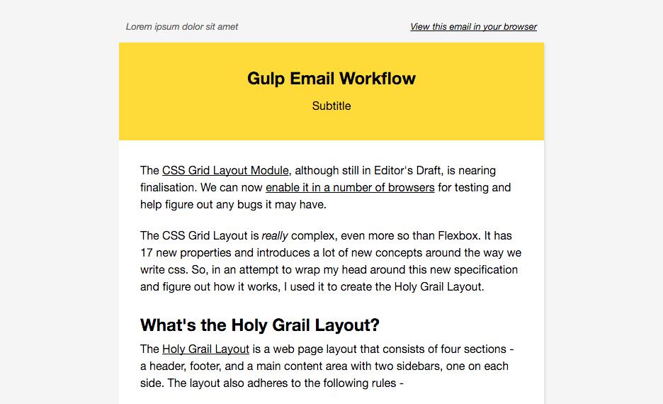

# A Gulp Workflow for Building HTML Emails




This is a workflow for building HTML emails using Gulp. It comes with a default MailChimp-supported template.

What it does -

1. Builds HTML email from templates and partials
2. Compiles SCSS to CSS
3. Inlines the `inline.css` file and embeds the `embedded.css` file
4. Generates a preview of emails
5. Creates a zip of the build directory for upload (optional)


## Getting Started


#### 1. Install dependencies

This workflow requires the following dependencies -

- Node.js with npm ([Install](https://github.com/joyent/node/wiki/Installing-Node.js-via-package-manager))
- Gulp.js (Install with `npm install gulp`)


#### 2. Clone this repository


```
git clone https://github.com/ireade/gulp-email-workflow.git
cd gulp-email-workflow
```

Or [download as a ZIP](https://github.com/ireade/gulp-email-workflow/archive/master.zip).


#### 3. Install packages

```
npm install
```


#### 4. Start build

```
npm start
```

The compiled and inlined output email will be in the `build/` directory. Can be previewed in browser at `http://localhost:8000`


## How to use

#### Creating templates

[Nunjucks](https://mozilla.github.io/nunjucks/) is used for compiling template files to HTML.

Templates are stored in `src/templates/` and partials in `src/templates/partials`. To create a template, create a file in the templates directory with the `.nunjucks` file extension. 

To include a partial in your template, use the following syntax -


```

```

To define a block of dynamic content to be replaced by the email file, use the following syntax -

```

```


#### Creating emails from templates

To create an email based off a template file, create a new file in the `src/emails/` directory (also with the `.nunjucks` file extension).

Specify which template to use using the following syntax -

```

```

To define the contents of a dynamic content block, use the following syntax -

```
 
Content goes here

```


#### Working with global data

Global data is stored in the `src/data` directory as JSON files. Include new data files in the config section at the top of the `gulpfile.js` - 

```javascript
var globalData = {
    DATA_NAME_1: require('./src/data/FILE_NAME_1.json'),
    DATA_NAME_2: require('./src/data/FILE_NAME_2.json')
};

```

For example -

```javascript
var globalData = {
    mailchimp: require('./src/data/mailchimp.json')
};

```


#### CSS

SASS files are stored in the `src/sass/` directory. There are two main SASS files -

- `inline.scss` for styles you w Liant to be inlined to their elements
- `embedded.scss` for styles that shouldn't be inlined. These will be inlcluded within a `<style>` element in the `<head>`

You can create subdirectories within the SASS folder to hold any partials. Make sure to precede the name of a partial with an underscore, e.g. `_reset.scss`.


#### Generating the zip file

You can also generate a zip file of the `build` directory for export. You can do this by running -

```
npm run zip
```

Alternatively, you can add it to the default and watch gulp tasks to have it generated automatically.


## Footnotes

- Created by [Ire Aderinokun](http://ireaderinokun.com)
- Contributions by [Zac Wasielewski](https://github.com/zacwasielewski)
- [MIT License](https://github.com/ireade/gulp-email-workflow/blob/master/license.txt)


